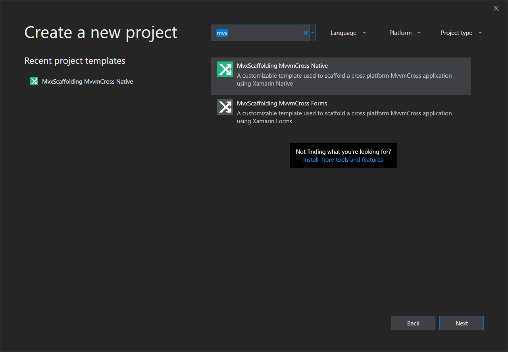
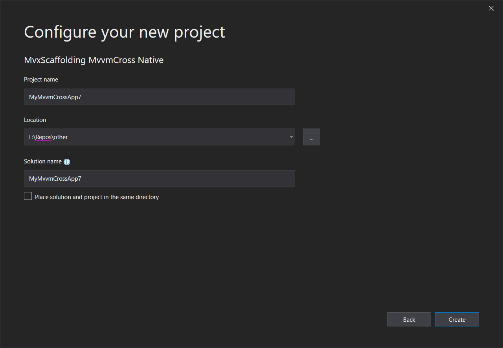
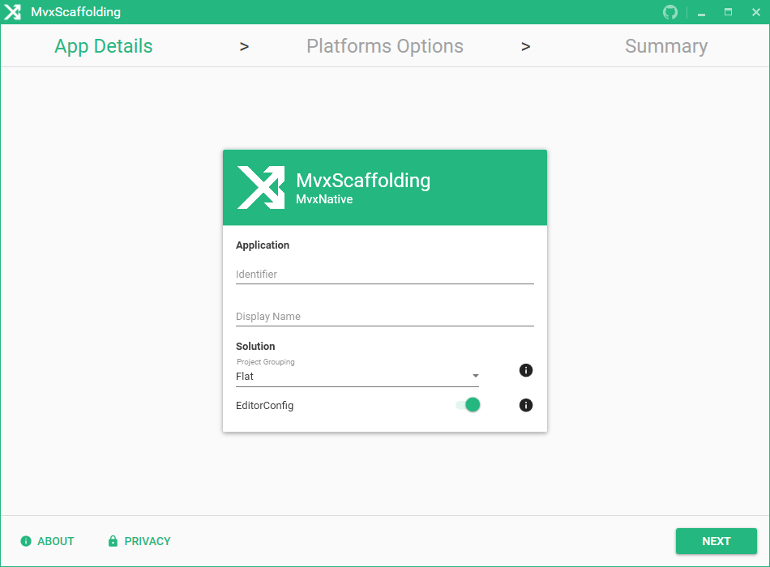
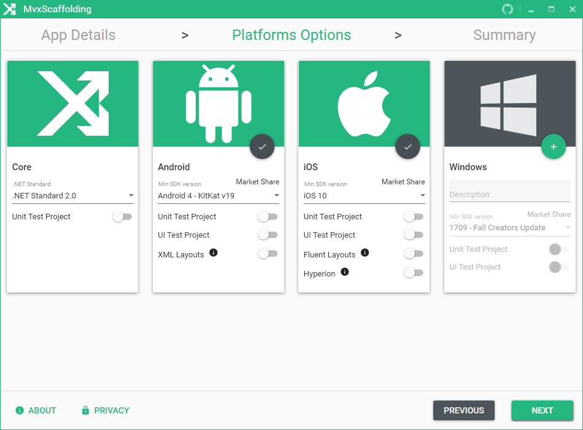
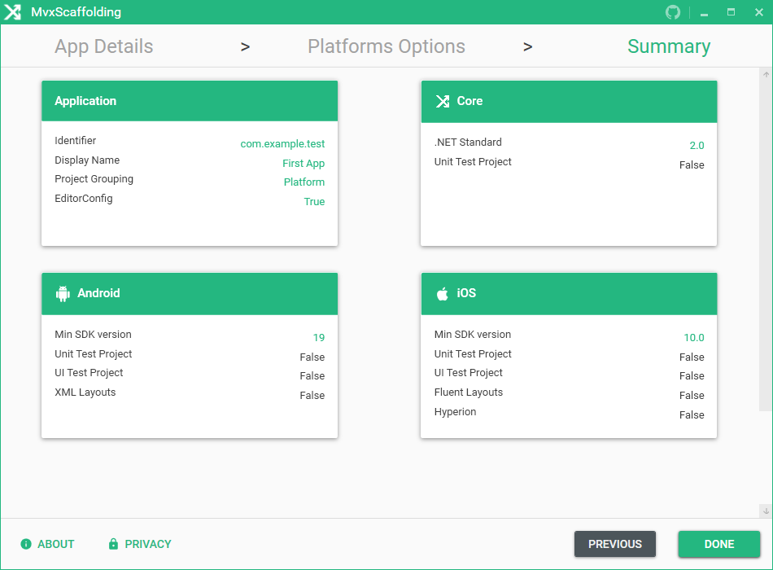

# Template - Visual Studio 2019 Extension

### 1.1 Select template type

MvxScaffolding Templates can be found by searching `Mvx`. ___Note___ MvxScaffolding can not be found via the drop-down filters (Language, Platform or Project Type). This feature will work in Visual Studio 2019 16.1 release.

You can select between

- __MvxScaffolding MvvmCross Native__ - Select this option to generate a solution using _native Xamarin_ Android, iOS and UWP projects.
- __MvxScaffolding MvvmCross Forms__ - Select this option to generate a solution using _Xamarin Forms_ Android, iOS and UWP projects.

### 1.2 Project name

Enter in your relevant project details. Then select `Create` to continue.

### 2. Enter application details

Enter in your relevant application details. Then select `Next` to continue.

You can select the ℹ️ to get more details about a specific option.

### 3. Select supported platforms and platform options

Select which platforms you want to support for your scaffolded application. By default `Android` and `iOS` are selected. You can select additional platforms by selecting the `+` or remove platforms by selecting the `✓`.

You can select the ℹ️ or row to get more details about a specific option.

Once you are satisfied with your choices select `Next` to continue.

### 4. Confirmation summary

Double check that you are happy with all your choices. You can adjust any choice by selecting `Previous` and navigating back to the relevant section.

Once you are satisfied with your choices select `Done` to start the template generating process.

